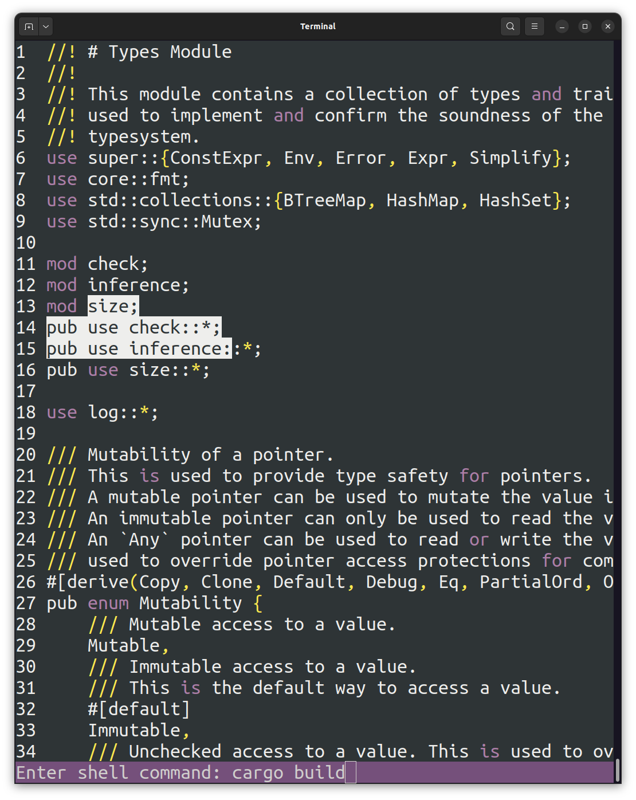
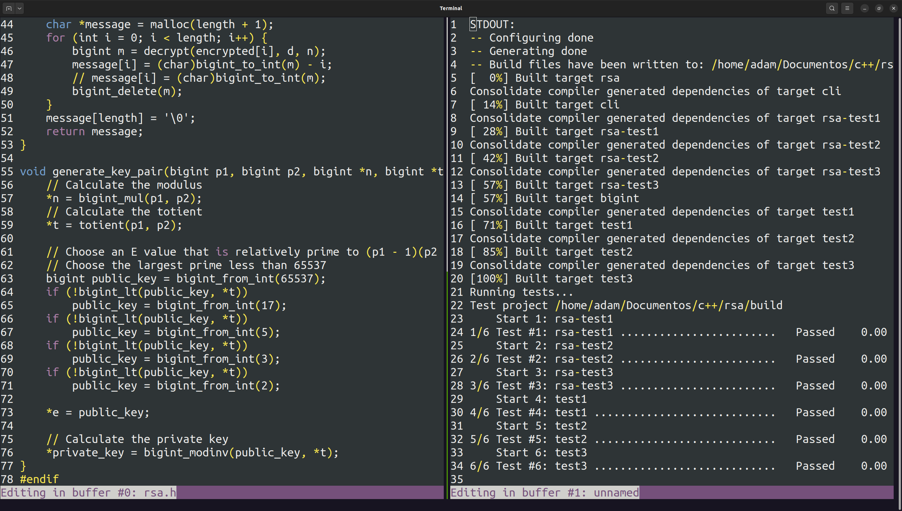
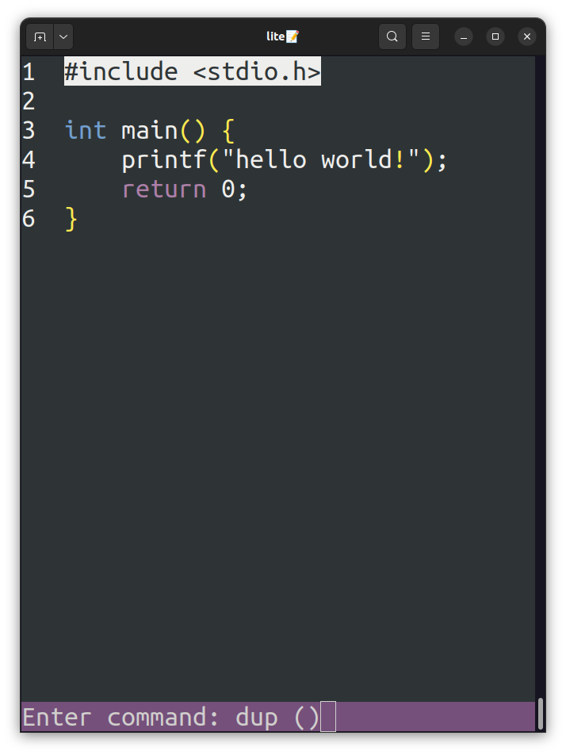
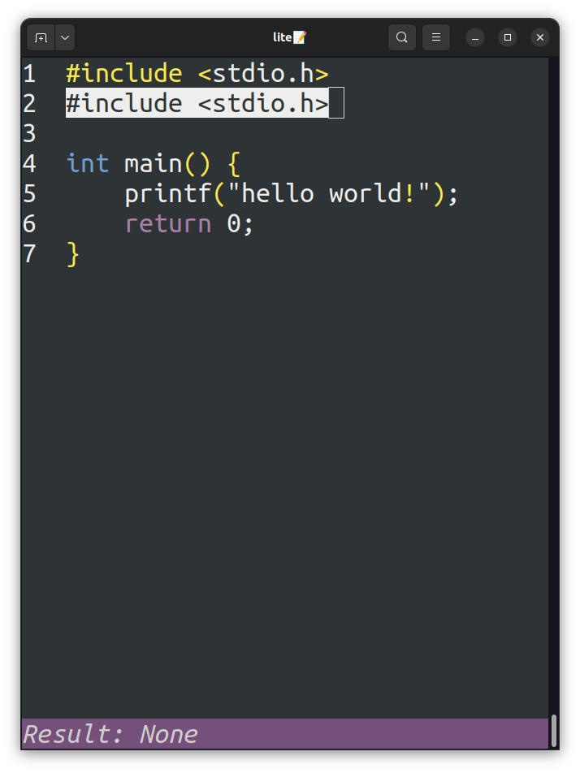
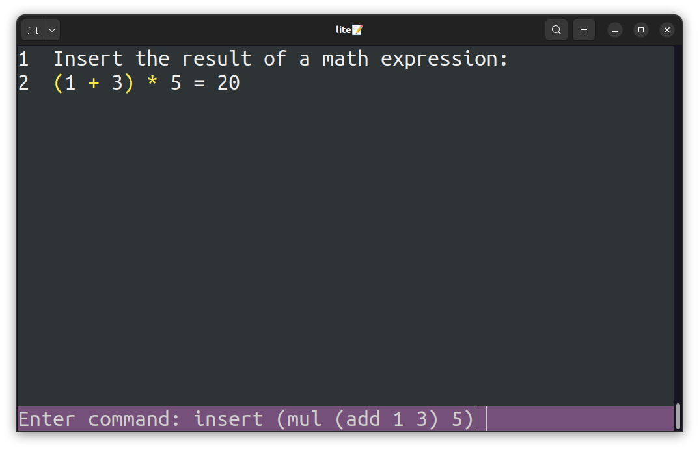
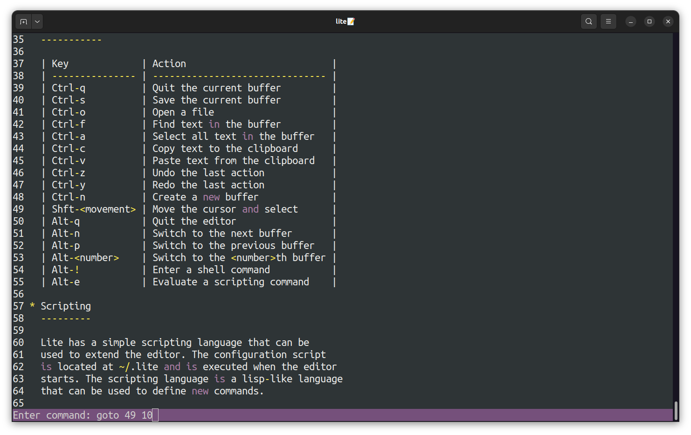

# lite📝


A lightweight and extensible text editor for the terminal with a custom scripting language, implemented in a few thousand lines of Rust.

## Table of Contents

- [Features](#features)
- [Installation](#installation)
- [Usage](#usage)
- [Contributing](#contributing)
- [License](#license)

## Features

<div align="center">
    
    
</div>

- [x] **Basic editing operations**: lite supports cut, copy, paste, find, and other common text editing operations.
- [x] **Syntax highlighting**: lite supports syntax highlighting for a variety of languages.
- [x] **Undo/redo**: lite supports the handling of undo and redo tree operations.
- [x] **Scripting Support**: lite has a builtin scripting language that can be used to extend its functionality!
- [x] **Shell commands**: lite lets you run shell commands from within the editor.
- [x] **Line numbers and status bar**: lite displays line numbers and a status bar at the bottom of the screen, which is used for interacting with the user for various commands.
- [x] **Multiple buffers**: lite supports switching between multiple buffers, which can be used as unsaved scratch buffers or to open multiple files.
- [x] **Save and open files**: lite supports saving and opening files from the disk.
- [x] **Simple keybindings**: lite has much simpler keybindings than Vim or Emacs, making it easy to use.

## Installation

You can install lite by using Cargo, the Rust package manager. Run the following command to install lite:

```bash
$ cargo install --git https://github.com/adam-mcdaniel/lite
```

This will install the `lite` executable in your `$HOME/.cargo/bin` directory. Make sure that this directory is in your `$PATH` so that you can run `lite` from anywhere in your terminal!

## Usage

To open a file in lite, simply run the following command:

```bash
$ lite <filename>
```

This will open an editor instance with a buffer containing the contents of the file. You can then start editing the file using the various editing operations supported by lite.

### Keybindings

Here are some of the keybindings supported by lite:

| Keybinding | Description |
|------------|-------------|
| `Ctrl-s`   | Save the current buffer to disk. |
| `Ctrl-q`   | Quit the current buffer. If it's unsaved, you'll be prompted to decide whether to save it to disk. |
| `Ctrl-c`   | Copy the selected text to the clipboard. |
| `Ctrl-x`   | Cut the selected text to the clipboard. |
| `Ctrl-v`   | Paste the text from the clipboard. |
| `Ctrl-d` | Delete the current selection, or the character to the right of the cursor if nothing is selected. |
| `Ctrl-z` | Undo the last change. |
| `Ctrl-y` | Redo the last undone change. |
| `Ctrl-f` | Find the next instance of text in the buffer. This will wrap on the last search. |
| `Ctrl-n` | Create a new, empty buffer. |
| `Ctrl-o` | Open a file in a new buffer. |
| `Ctrl-a` | Select all text in the buffer. |
| `Shift-<cursor movement>` | Move the cursor while selecting text. |
| `Alt-q` | Leave the editor. |
| `Alt-n` | Switch to the next buffer. |
| `Alt-p` | Switch to the previous buffer. |
| `Alt-<number>` | Switch to the buffer with the corresponding number. |
| `Alt-!` | Enter a shell command. The output will be opened in a new scratch buffer upon completion. |

### Scripting

Lite has a builtin scripting language that can be used to extend its functionality. The scripting language is a simple lisp-like language that can be used to setup your editor and add new commands. Here's an example of a simple script that adds a new command to the editor:

```rs
# In the "$HOME/.lite" file, add the following definition

# Add a command to duplicate the current selection
# down one line
let dup = _ -> {
  let selected = get-select ();
  let old-select-end = get-select-end ();
  let select-size = get-select-len ();
  goto (get-select-end ());
  unselect ();
  insert (add "\n" selected);
  goto old-select-end;
  move 1;
  select ();
  move select-size;
};
```

Now, we can see this command in action by running the following keybinding:

```rs
Alt-e dup () ENTER
```

| **Before** | **After** |
|:--------:|:-------:|
|  |  |

You can directly manipulate the editor using commands like `goto`, `move`, `insert`, `delete`, `select`, `unselect`, and `get-select`. You can also define new commands using the `let` keyword, and then run them using the `Alt-e` keybinding.

<div align="center">
    
    
</div>

## Contributing

Contributions are welcome! Feel free to open issues or pull requests if you have any suggestions or improvements to the project. It's always great to have more people involved in development!

## License

This project is licensed under the MIT License - see the [LICENSE](LICENSE) file for details.